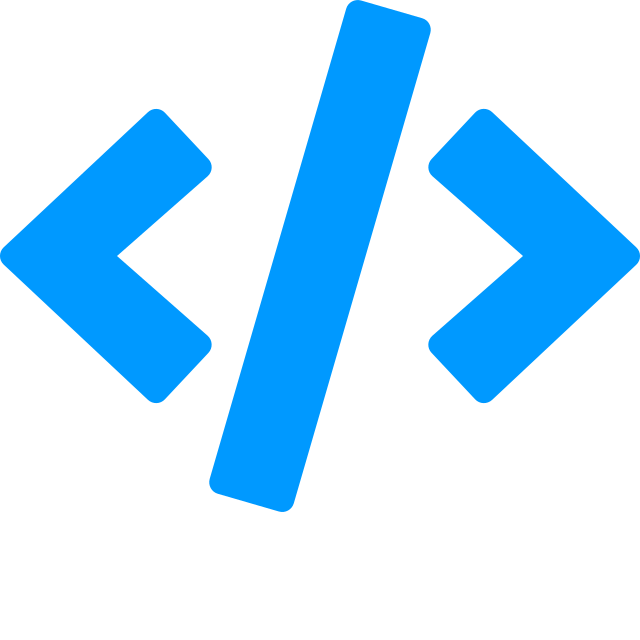

# Python 3

[A Byte of Python](/bop/)
: “A Byte of Python” – это свободная книга по программированию на языке Python. Она может служить учебным пособием или руководством по языку Python для начинающей аудитории

[Типы](types/index.md)
: Типы данных в Python 3

[Модули](modules/index.md)
: Основные модули в Python 3. Описание модулей и перевод документации к ним

!!!abstract "Справочники"

    [{: style="height:16px;width:16px;vertical-align:middle;"} HTML + CSS](https://hcdev.ru/) &nbsp;&nbsp;&nbsp;
    [{: style="height:16px;width:16px;vertical-align:middle;"} Typescript](https://scriptdev.ru/) &nbsp;&nbsp;&nbsp;
    [{: style="height:16px;width:16px;vertical-align:middle;"} Angular](https://angdev.ru/) &nbsp;&nbsp;&nbsp;
    [{: style="height:16px;width:16px;vertical-align:middle;"} React](https://reactdev.ru/) &nbsp;&nbsp;&nbsp;
    [{: style="height:16px;width:16px;vertical-align:middle;"} React Native](https://reactnativedev.ru/) &nbsp;&nbsp;&nbsp;
    [{: style="height:16px;width:16px;vertical-align:middle;"} Node.js](https://nodejsdev.ru/) &nbsp;&nbsp;&nbsp;
    **[{: style="height:16px;width:16px;vertical-align:middle;"} Python 3](https://py3dev.ru/)** &nbsp;&nbsp;&nbsp;
    [{: style="height:16px;width:16px;vertical-align:middle;"} XSLT](https://xsltdev.ru/)
